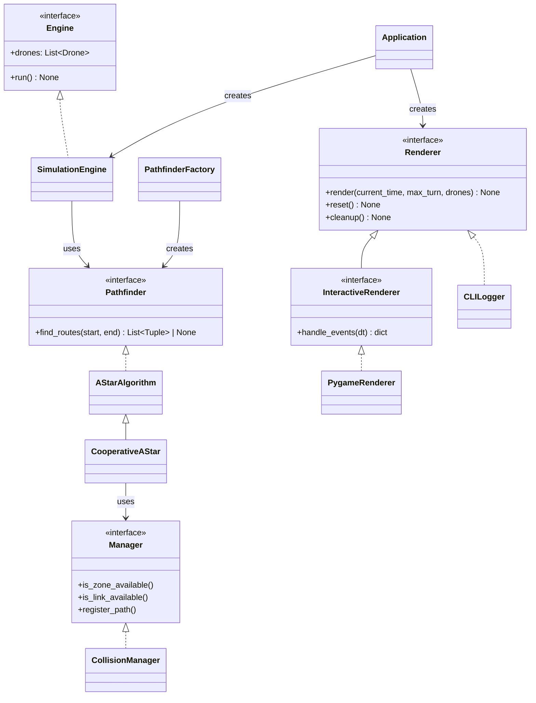
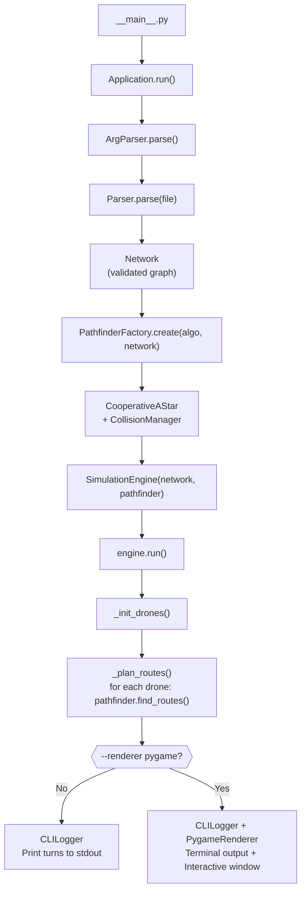
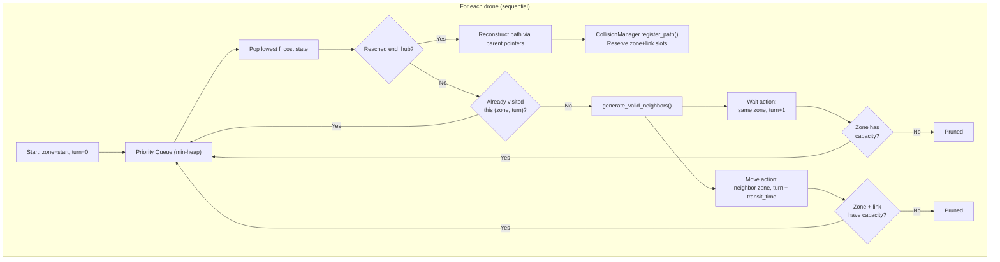

*This project has been created as part of the 42 curriculum by vlnikola.*

# Fly-in

A Python simulation of drones moving through a graph of zones and connections while respecting turn-based movement, zone occupancy, and connection capacity rules.

The main goal is to route every drone from the **start hub** to the **end hub** in as few turns as possible while avoiding collisions and respecting all capacity constraints.

---

## Table of Contents

- [Description](#description)
- [Project Structure](#project-structure)
- [Architecture Overview](#architecture-overview)
- [Instructions](#instructions)
  - [Requirements](#requirements)
  - [Installation](#installation)
  - [Run](#run)
  - [Map Format](#map-format)
- [Algorithm and Implementation Strategy](#algorithm-and-implementation-strategy)
  - [Application Pipeline](#application-pipeline)
  - [Pathfinding: Cooperative Space-Time A*](#pathfinding-cooperative-space-time-a)
  - [How the Heuristic Works](#how-the-heuristic-works)
  - [Generating Space-Time Neighbors](#generating-space-time-neighbors)
  - [Priority Queue (heapq)](#priority-queue-heapq)
  - [Complexity](#complexity)
  - [Caching and Recalculation](#caching-and-recalculation)
  - [Memory Usage](#memory-usage)
  - [Advantages and Disadvantages](#advantages-and-disadvantages)
- [Simulation Output](#simulation-output)
- [Visual Representation](#visual-representation)
- [Useful Commands](#useful-commands)
- [Resources](#resources)
- [AI Usage](#ai-usage)

---

## Description

Fly-in is built around a modular, interface-driven architecture:

- **Parser** — reads and validates a custom map format into a `Network` domain model.
- **Models** — `Zone`, `Connection`, `Drone`, and `Network` represent the simulation data using Pydantic and dataclasses.
- **Interfaces** — abstract base classes (`Pathfinder`, `Engine`, `Renderer`, `Manager`, `Runnable`) define contracts that all components implement.
- **Algorithm** — a Cooperative Space-Time A* pathfinder plans collision-free routes for every drone sequentially.
- **Engine** — creates drones, delegates route planning to the pathfinder, and produces a list of planned paths.
- **Renderer** — two interchangeable implementations: a console printer and an interactive Pygame visualizer.

Every component depends on interfaces rather than concrete classes, making it easy to swap out the pathfinding algorithm, add a new renderer, or change the simulation engine without touching the rest of the code.

---

## Project Structure

```
fly-in/
├── pyproject.toml             # Project metadata and dependencies (uv)
├── uv.lock                    # Dependency lockfile
├── Makefile                   # Build, run, lint, and clean targets
├── imgs/
│   └── drone.bmp              # Drone sprite for the Pygame visualizer
├── maps/                      # Example map files
│   ├── easy/
│   ├── medium/
│   ├── hard/
│   └── challenger/
└── src/                       # Main source package
    ├── __init__.py
    ├── __main__.py            # Entry point: python -m src
    ├── app/
    │   ├── application.py     # Application — wires everything together
    │   └── controller.py      # SimulationController — playback loop
    ├── interfaces/            # Abstract base classes (contracts)
    │   ├── algorithm.py       #   Pathfinder — find_routes()
    │   ├── engine.py          #   Engine — exposes drones and run()
    │   ├── renderer.py        #   Renderer & InteractiveRenderer
    │   └── collision_manager.py  # Manager — zone/link availability
    ├── models/                # Domain models
    │   ├── zone.py            #   Zone + ZoneType enum
    │   ├── connection.py      #   Connection (edge between zones)
    │   ├── drone.py           #   Drone + DroneStatus enum
    │   ├── network.py         #   Network (validated graph + adjacency lists)
    │   └── temporal_state.py  #   TemporalState (A* search node)
    ├── parsers/               # Input parsing
    │   ├── arg_parser.py      #   CLI argument parser (argparse)
    │   └── parser.py          #   Map file parser → Network
    ├── algorithm/             # Pathfinding strategies
    │   ├── factory.py         #   PathfinderFactory (creates algorithm by name)
    │   └── coop_a_star/       #   Cooperative Space-Time A* implementation
    │       ├── a_star.py      #     AStarAlgorithm (abstract base)
    │       ├── algorithm.py   #     CooperativeAStar (concrete implementation)
    │       └── manager.py     #     CollisionManager (reservation table)
    ├── engine/
    │   └── engine.py          # SimulationEngine — drone lifecycle + routing
    └── renderer/              # Output / visualization
        ├── cli_logger.py      #   CLILogger — prints turns to stdout
        ├── factory.py         #   RendererFactory — creates renderers
        ├── hud_stats.py       #   HUD statistics dataclass
        └── pygame/            #   Pygame interactive visualizer
            ├── colors.py      #     Color enum
            ├── config.py      #     Display configuration
            ├── renderer.py    #     PygameRenderer
            └── drawers/       #     Drawing components
```

---

## Architecture Overview

The project follows an object-oriented design where every major component implements an abstract interface. This diagram shows how the key classes relate to each other:



**Why interfaces?** By coding against `Pathfinder` instead of `CooperativeAStar`, the `SimulationEngine` does not need to know _which_ algorithm is being used. If you write a new algorithm (e.g., `CBSAlgorithm`), you just implement the `Pathfinder` interface and register it in `PathfinderFactory` — zero changes in the engine.

---

## Instructions

### Requirements

- **make**
- **Python >= 3.10**
- **[uv](https://docs.astral.sh/uv/)** — fast Python package manager (replaces pip/venv)
- `pygame >= 2.0.0`
- `pydantic >= 2.5.0`

### Installation

```bash
make install
```

This uses `uv sync` to create a virtual environment and install all project dependencies from `pyproject.toml`.

### Run

Running `make run` without a `FILE` argument auto-generates a temporary test map that covers all zone types, colors, and capacities. The temp file is cleaned up automatically after the simulation ends.

```bash
make run
```

You can also provide your own map or extra arguments:

```bash
# Run a specific map
make run FILE=maps/hard/02_capacity_hell.txt

# Enable the Pygame visualizer at 2x speed
make run ARGS="--renderer pygame --speed=2.0"

# Combine both
make run FILE=maps/hard/02_capacity_hell.txt ARGS="--renderer pygame"
```

Or run the simulator directly:

```bash
python -m src maps/easy/01_linear_path.txt
python -m src maps/medium/03_priority_puzzle.txt --renderer pygame
python -m src maps/hard/02_capacity_hell.txt --renderer pygame --speed 2.0
```

> [!TIP]
> When running with `--renderer pygame`, you can **pause/resume** with `Space`, **scrub time** with `Left`/`Right` arrow keys, **reset** with `R`, or **quit** with `Esc`.

### Map Format

The parser expects a text file with:

- `nb_drones: <positive_integer>` on the first meaningful line,
- exactly one `start_hub:` entry,
- exactly one `end_hub:` entry,
- any number of `hub:` entries,
- `connection:` entries between previously defined zones.

**Zone metadata** (inside `[brackets]`):

| Key          | Values                                         | Default    |
|--------------|-------------------------------------------------|------------|
| `zone`       | `normal`, `blocked`, `restricted`, `priority`   | `normal`   |
| `color`      | any named color (e.g., `green`, `cyan`, `gold`) | `white`    |
| `max_drones` | positive integer                                | `1`        |

**Connection metadata:**

| Key                 | Values           | Default |
|---------------------|------------------|---------|
| `max_link_capacity` | positive integer | `1`     |

**Example map:**

```text
nb_drones: 4
start_hub: start 0 0 [zone=normal color=green max_drones=4]
end_hub: goal 6 0 [zone=normal color=gold]
hub: a 2 0 [zone=priority color=cyan]
hub: b 4 0 [zone=restricted color=purple]
connection: start-a [max_link_capacity=2]
connection: a-b [max_link_capacity=1]
connection: b-goal [max_link_capacity=1]
```

**Validation rules:**
- Exactly one `start_hub` and one `end_hub` must be present.
- Zone names cannot contain dashes (`-`), since dashes are used to delimit connection endpoints.
- Duplicate zone names, coordinates, or connections are rejected.
- Negative capacities or drone counts are rejected.
- Connections to undefined or self-referencing zones are rejected.
- Invalid zone types (anything other than `normal`, `blocked`, `restricted`, `priority`) are rejected.
- The `max_drones` metadata on `start_hub` and `end_hub` is **ignored** — these zones have unlimited capacity.

---

## Algorithm and Implementation Strategy

### Application Pipeline

This is what happens when you run the simulator end-to-end:



**Step by step:**

1. `Application.run()` parses CLI arguments and reads the map file.
2. `Parser` validates the file line-by-line and builds a `Network` object (Pydantic model with validators).
3. `PathfinderFactory.create()` picks the algorithm by name (currently only `"coop"`) and injects a fresh `CollisionManager`.
4. `SimulationEngine` receives the `Network` and `Pathfinder` via its constructor (dependency injection through interfaces).
5. `engine.run()` creates the drone fleet and plans a route for each drone sequentially. Each planned path is immediately registered in the `CollisionManager`, so the next drone sees updated reservations.
6. Finally, a `Renderer` (either `CLILogger` alone, or `CLILogger` + `PygameRenderer`) visualizes the results.

---

### Pathfinding: Cooperative Space-Time A*

The core problem is **Multi-Agent Pathfinding (MAPF)**. To solve this efficiently without the exponential overhead of joint-state searching, the project uses **Cooperative Space-Time A***.

Instead of searching in a standard 2D spatial graph, the algorithm searches in a **3D space-time graph** where each node is `(Zone, Turn)`.



**Key ideas:**

1. **Sequential Planning** — drones are routed one at a time. Once a drone's path is found, it is locked in.
2. **Reservation Table** — the `CollisionManager` stores which zones and links are occupied at each turn. Future drones check this table before committing to a move.
3. **Waiting** — a drone can "wait" at its current zone (same zone, turn + 1) if the path ahead is blocked, provided the zone still has capacity.
4. **Zone Types** affect movement cost and transit time:

| Zone Type    | Transit Time | A* Cost | Behavior                            |
|-------------|-------------|---------|--------------------------------------|
| `normal`    | 1 turn       | 1.0     | Standard movement                   |
| `priority`  | 1 turn       | 0.8     | Cheaper — A* prefers these paths    |
| `restricted`| 2 turns      | 2.0     | Slow — drone is "mid-transit" for 2 turns |
| `blocked`   | —            | —       | Impassable — completely pruned       |

---

### How the Heuristic Works

A* uses the cost function `f(n) = g(n) + h(n)`:
- **g(n)** — the actual accumulated cost from start to node `n`.
- **h(n)** — the heuristic estimate from node `n` to the goal.

For A* to find the optimal path, the heuristic must be **admissible** (never overestimates the true cost).

This project uses **Manhattan Distance** as the heuristic:

```
h(n) = ( |x_current - x_goal| + |y_current - y_goal| ) × 0.25
```

**Why the `× 0.25` scaling factor?** Because `priority` zones cost only `0.8` per step. If the heuristic used raw Manhattan distance (cost `1.0` per step), it could overestimate the true cost through a chain of priority zones, making it **inadmissible**. Scaling down by `0.25` guarantees the heuristic never overestimates, at the cost of exploring a few extra nodes.

---

### Generating Space-Time Neighbors

The `generate_valid_neighbors()` method in `CooperativeAStar` is the core of the space-time adaptation. For every state it evaluates two types of moves:

1. **Wait Action** — the drone stays at its current zone while time advances by 1 turn. The `CollisionManager` checks that the zone still has capacity at `turn + 1`.

2. **Move to Adjacent Zone** — for each physically connected neighbor:
   - Check `is_traversable` (blocked zones are pruned).
   - Calculate `transit_time` and `movement_cost` from the zone type.
   - Check `CollisionManager` for **link capacity** during every turn of transit.
   - Check `CollisionManager` for **zone capacity** at the arrival turn.
   - If everything passes, create a new `TemporalState` with updated costs and a parent pointer.

---

### Priority Queue (heapq)

The algorithm uses Python's `heapq` module (min-heap) for the open set.

- `heappop()` always returns the state with the lowest `f_cost` — **O(log N)**.
- `heappush()` inserts a new state — **O(log N)**.
- The `TemporalState` dataclass has `f_cost` as its first field and uses `@dataclass(order=True)`, so `heapq` can compare states directly without custom sort functions.

### Complexity

Let `S` be the number of explored space-time states for a single drone.

- Route planning per drone: **O(S log S)** (heap-based A*).
- Neighbor generation: proportional to the degree of the current zone.
- Reservation lookups: **O(1)** average (dictionary-based).
- Total: scales linearly with the number of drones, since each drone is planned sequentially.

### Caching and Recalculation

Routes are **not** globally cached between drones. Each drone gets a freshly planned path, and the `CollisionManager` accumulates the reservations from all previously planned drones. This avoids the complexity of invalidating a shared cache when later drones change the available space-time slots.

### Memory Usage

Memory is mainly driven by:

- the parsed graph structure (`Network`),
- the `CollisionManager` reservation table (grows with scheduled zone-turn and link-turn entries, not with every possible turn),
- the A* open set and visited states during planning,
- one stored path per drone.

### Advantages and Disadvantages

**Advantages:**

- **Simple to implement** — the algorithm is a straightforward extension of single-agent A* with a shared reservation table. No complex conflict resolution logic is needed.
- **Fast in practice** — each drone runs a standard A* search, and reservation lookups are O(1). On maps with enough capacity, all drones find paths quickly.
- **Deterministic** — the same input always produces the same output, making debugging and testing straightforward.
- **Scalable for well-connected maps** — when the graph has multiple disjoint paths, drones naturally spread across them because earlier drones reserve the fastest routes, pushing later drones to alternatives.

**Disadvantages:**

- **Greedy sequential ordering** — the first drone planned always gets the globally optimal path. Every subsequent drone works with a more constrained reservation table. This means later drones may get significantly worse paths, even when a globally better solution exists where all drones share the cost more evenly. The total turn count depends heavily on the planning order.
- **No global optimality** — because drones are planned one at a time, the algorithm cannot guarantee a globally optimal solution. For example, the first drone might occupy a chokepoint for 3 turns when rerouting it by 1 extra turn would free the chokepoint for 5 other drones, saving turns overall.
- **Conflict-Based Search (CBS) addresses this** — CBS is an alternative MAPF algorithm that plans all agents simultaneously. Instead of sequential planning, CBS detects conflicts between agents and splits the search into branches where each branch resolves a specific conflict. This produces globally optimal solutions but at a higher computational cost (exponential in the worst case). For this project, Cooperative A* was chosen for its simplicity and good-enough performance on the provided maps.
- **Order-dependent results** — shuffling the drone planning order can produce different total turn counts. A potential improvement would be to try multiple orderings and pick the best result, or to use priority-based ordering (e.g., plan drones with the longest shortest-path first).

---

## Simulation Output

The engine (or console renderer) prints one line per turn when drones move:

```text
D1-a D2-b
D1-a-b D2-goal
D1-b
D1-goal
```

**In-Transit Output:** Notice `D1-a-b` — when a drone travels through a `restricted` zone (2 turns), it is shown as `current_zone-next_zone` to indicate it is mid-transit between two points.

When using `--renderer pygame`, the same turn log is still printed to the terminal alongside the interactive window.

---

## Visual Representation

The optional Pygame visualizer (`--renderer pygame`) opens a live window that brings the simulation to life.

**Key features:**

- **Animated drone motion** — positions are interpolated between turns at 60 FPS using smooth-step easing, so drones glide instead of jumping.
- **Node display** — each zone is drawn as a colored circle showing its x,y coordinates, capacity number, and a type abbreviation (`Start`, `End`, `R`, `P`, `B`).
- **Connection rendering** — edges are drawn with a link capacity label at the midpoint. A chessboard-like coordinate offset prevents overlapping parallel connections.
- **Drone markers** — in-node drones get a red label; in-transit drones get a gray label. When multiple drones overlap, the label shows the count (e.g., `2D`).
- **Heads-Up Display (HUD)** — a bottom panel shows: total drones, active (moving) drones, average turns per drone, and total path cost.
- **Interactive controls:**

| Key              | Action        |
|------------------|---------------|
| `Space`          | Play / Pause  |
| `Left` / `Right` | Scrub time    |
| `R`              | Reset to start|
| `Esc`            | Quit          |

**Limitations:** The window size is calculated from the map's coordinate extremes using a fixed tile size. Very large maps may overflow the screen since there is no zooming or panning.

---

## Useful Commands

```bash
make install       # Sync dependencies with uv
make run           # Run with auto-generated test map
make debug         # Run with Python's pdb debugger
make lint          # flake8 + mypy type checking
make lint-strict   # Strict mypy mode
make clean         # Remove venv, caches, and temp files
make clean-cache   # Remove caches and temp files only
make help          # Show all available targets
```

---

## Resources

- Python documentation: https://docs.python.org/3/
- `heapq` documentation: https://www.geeksforgeeks.org/python/heap-queue-or-heapq-in-python/
- Pygame documentation: https://www.pygame.org/docs/
- A* search overview: https://www.datacamp.com/tutorial/a-star-algorithm
- Cooperative A*:
`David Silver. 2005. Cooperative pathfinding. In Proceedings of the First AAAI Conference on Artificial Intelligence and Interactive Digital Entertainment (AIIDE'05). AAAI Press, 117–122.`
- 42 project subject and map files included in this repository

---

## AI Usage

AI assistance was utilized during the development of this project for the following tasks:
- **Algorithm Comprehension:** AI helped me better understand the algorithm, especially the space-time pathfinding part.
- **Debugging and Refactoring:** Assisting in identifying edge cases within the space-time A* pathfinding implementation.
- **Documentation & Testing:** Helping structure and proofread this `README.md` to ensure it meets all curriculum requirements, and generating PEP 257 compliant docstrings for classes and methods across the codebase.
- **Visuals & Rendering:** AI helped implement a smoothstep (sigmoid-like) function for drone animation interpolation, suggested using `pygame.gfxdraw` for anti-aliased circles, and assisted in a rendering redesign to allow for fast color theme changes and reduced manual drawing work.
- **Design Patterns:** AI explained and demonstrated SOLID and OOP principles in practice, helping me structure the codebase more effectively.

The core logical design, algorithmic choices, and constraints enforcement were driven by the developer, with AI acting as a supportive peer-programming tool.